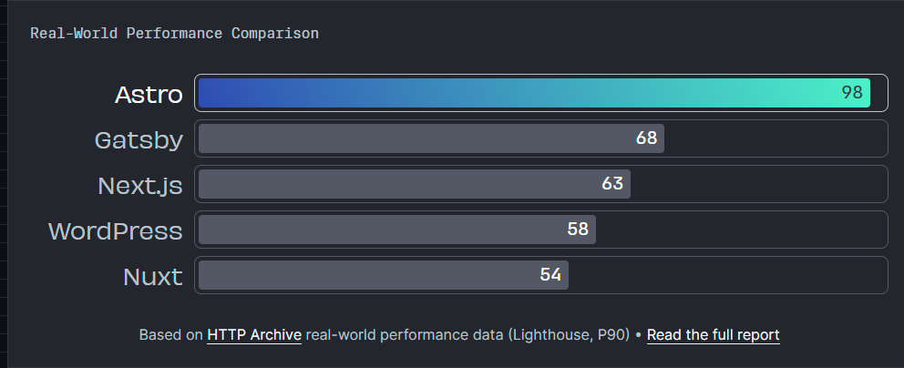

After all these years, Finally a meaningful post. Not a markdown cheat-sheet, not a teaser/update about forgotten half completed project (although ["teaser" project](../new-post-teaser) had three upgrades after that post, I never find time to write about.) With this post again I'm plaining to motivate myself to write regularly, hopefully this time I will be successful. So let's start.

## Why the change and Why Astro?

Of course new is **always** better. And I need something to write about.

_mandatory xkcd comic_

During my free time I was thinking about Next.js (everybody thinks React.js frameworks on their free time right?) but when I was writing my "triennial" teaser post came across the new kid in town the [Astro](https://astro.build/). (To be thorough, I'm not sure if Astro newer than Next.js or even Gatbsy. Important thing is I find it newly :))

_and it's claims speed !!_

Astro has interesting features like. Server side support, good for dynamic sites but we are building a blog so it's not important. Islands, looks like microfrontend paradigm, useful for modularity (Do not quote me on that) again not needed for our blog. UI-agnostic design, wonderful feature you can use whatever you want for UI like Html,React,Svelte, HTMX (My new dream after technology, maybe on the next triennial update 🤞). Plugin ecosystem, plugins look more complete I'm not sure why it's just a gut feeling. First class Typescript support (maybe forced too not sure), maybe controversial but I have never coded with javascript project Typescript must have for me.

## How

Classily I'm writing a step step by guide. I'm mainly writing about my journey to Astro.

### Requirements

- A blog theme
- Multiple Author support
- Comment system
- Auto build & deploy

For theme we are going with [AstroPaper](https://github.com/satnaing/astro-paper) a minimal blog theme. Of course we are still supporting Multiple Author feature for Guest Authors on the blog (there is only one post from guest Author). Comment system disqus getting old, so this year we are changing it to Github Discussions with aptly named [Giscus](https://giscus.app/). For build system Travis was working but they removed my free credits (they fixes)
